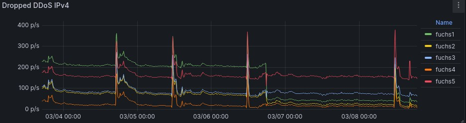

[](https://github.com/vshymanskyy/StandWithUkraine/blob/main/docs/README.md)

# Torutils

Few tools for a Tor relay.

## Block DDoS (ingress)

The scripts [ipv4-rules.sh](./ipv4-rules.sh) and [ipv6-rules.sh](./ipv6-rules.sh) protect a Tor relay
against DDoS attacks¹ at the IP [network](https://upload.wikimedia.org/wikipedia/commons/3/37/Netfilter-packet-flow.svg) layer, as seen in this metrics:



An older example is [here](./doc/network-metric-July-3rd.jpg).

¹ see ticket [40636](https://gitlab.torproject.org/tpo/core/tor/-/issues/40636)
and [40093](https://gitlab.torproject.org/tpo/community/support/-/issues/40093)
of the [Tor project](https://www.torproject.org/).

### Idea

Mark an IP address as malicious if its connection attempts over a short time interval exceed a given threshold.
Then block that IP for a long time interval.

Therefore a simple network rule won't make it.
However _ipset_ helps to achieve the goal.
Further considerations:

- never touch established connections
- avoid to not overblock

### Quick start

Install _jq_, _ipset_ and _iptables_, e.g. for Debian or Ubuntu do:

```bash
sudo apt update
sudo apt install -y jq ipset iptables
```

Download the DDoS prevention scripts

```bash
wget -q https://raw.githubusercontent.com/toralf/torutils/main/ipv4-rules.sh -O ipv4-rules.sh
wget -q https://raw.githubusercontent.com/toralf/torutils/main/ipv6-rules.sh -O ipv6-rules.sh
chmod +x ./ipv4-rules.sh ./ipv6-rules.sh
```

Make a backup of the current iptables _filter_ table:

```bash
sudo /usr/sbin/iptables-save >./rules.v4
sudo /usr/sbin/ip6tables-save >./rules.v6
```

Run a quick test

```bash
sudo ./ipv4-rules.sh test
sudo ./ipv6-rules.sh test
```

Best is to stop the Tor service(s) now.
Then flush the connection tracking table

```bash
sudo /usr/sbin/conntrack -F
```

and (re-)start the Tor service.
Check that your ssh login and your other services are still working.
Watch the iptables live statistics by:

```bash
sudo watch -t ./ipv4-rules.sh # replace 4 with 6 for IPv6
```

If something failed then restore the backuped state:

```bash
sudo ./ipv4-rules.sh stop
sudo ./ipv6-rules.sh stop
sudo /usr/sbin/iptables-restore <./rules.v4
sudo /usr/sbin/ip6tables-restore <./rules.v6
```

But if everything looks ok, then run the DDoS script with the parameter `start`:

```bash
sudo ./ipv4-rules.sh start
sudo ./ipv6-rules.sh start
```

Now ensure, that the package _iptables-persistent_ is either de-installed or at least disabled.
Create cron jobs (via `crontab -e`) e.g.:

```cron
# DDoS prevention
@reboot /root/ipv4-rules.sh start; /root/ipv6-rules.sh start

# have recent ipset data after a reboot available
@hourly /root/ipv4-rules.sh save; /root/ipv6-rules.sh save

# update Tor authorities
@daily  /root/ipv4-rules.sh update; /root/ipv6-rules.sh update
```

I appreciate reports about any findings via the [issue](https://github.com/toralf/torutils/issues) tracker.

### Details

The DDoS script creates generic filter rules for the local network, ICMP, ssh, DHCP and additional services (if given).

Then this rule set is applied to prevent DDoS attampts against the Tor port:

1. trust any connection attempt from a trusted Tor authority server
2. block the source¹ for 24 hours if the connection attempt rate from it to the Tor port exceeds 9/min² within last 2 minutes
3. ignore the connection attempt if there are already 8 established connections to the Tor port (8 is the allowed relay amount per ip address)
4. ignore the connection attempt if the source is in a special ipset³
5. accept the connection attempt to the Tor port

¹ For IPv4 _source_ means a single ip address, for IPv6 a /56 hostmask is considered as default for a system

² The value is roughly derived from [ticket 40636](https://gitlab.torproject.org/tpo/core/tor/-/issues/40636#note_2844146).

³ Hosters providing an IPv6 /64 hostmask for a system are handled by [this](./ipv6-rules.sh#L127) quirk,
just create a cronjob like `*/5 * * * * /opt/torutils/ipv6-rules.sh manual` to activate it;
entries to this ipset can be added/removed from outside too, its name is `tor_manual[6]_<Tor port>`

If the DDoS script fails to parse the Tor and/or the SSH config then overrule the parsing either by:

1. define the local running relay/s explicitly at the command line after the keyword `start`, e.g.:

   ```bash
   sudo ./ipv4-rules.sh start 1.2.3.4:443 5.6.7.8:9001
   ```

1. -or- define them as environment variables, e.g.:

   ```bash
   sudo CONFIGURED_RELAYS="5.6.7.8:9001 1.2.3.4:443" ./ipv4-rules.sh start
   ```

   (`CONFIGURED_RELAYS6` for IPv6).

A command line argument takes precedence over the corresponding environment variable.

Allow inbound traffic to additional <address:port> destinations by e.g.:

```bash
export ADD_LOCAL_SERVICES="2.71.82.81:828 3.141.59.26:53"
export ADD_LOCAL_SERVICES6="[cafe::abba]:1234"
```

A slightly different syntax is used for `ADD_REMOTE_SERVICES` to allow inbound traffic, e.g.:

```bash
export ADD_LOCAL_SERVICES="4.3.2.1>4711"
export ADD_LOCAL_SERVICES6="[cafe::abba]>4711"
```

(the separator `>` is used instead `:` to highlight that the address is _src_, and the port is _dst_)

The above allows traffic from the specified remote address to the local port 4711.

Please note: The script sets few _sysctl_ values.
If unwanted then comment out the code around _setSysctlValues()_.
If Hetzners [system monitor](https://docs.hetzner.com/robot/dedicated-server/security/system-monitor/) isn't used,
then comment out _addHetzner()_ too.
To append rules onto an existing _iptables_ rule set (overwrite is the default) comment out the call _clearRules()_.

### Metrics

The script [metrics.sh](./metrics.sh) exports DDoS metrics into a Prometheus readable file.
More details plus few Grafana dashboards are [here](./dashboards/README.md).

### DDoS examples

Graphs¹ of rx/tx packets, traffic and socket counts from [5th](./doc/network-metric-Nov-5th.svg),
[6th](./doc/network-metric-Nov-6th.svg) and [7th](./doc/network-metric-Nov-7th.svg) of Nov
show the results for few DDoS attacks over 3 days
for 2 relays.
A more heavier attack was observed at [12th](./doc/network-metric-Nov-12th.svg) of Nov.
A periodic drop down of the socket count metric, vanishing over time, appeared at
[5th](./doc/network-metric-Dec-05th.svg) of Dec.
Current attacks e.g. at the [7th](./doc/network-metric-Mar-7th.svg) of March are still handled well.
Few more helper scripts were developed to analyze the attack vector.
Look [here](./misc/README.md) for details.

¹ using [sysstat](http://sebastien.godard.pagesperso-orange.fr/), created e.g. by

```bash
# create the SVG file
svg=/tmp/graph.svg
sadf -g -t /var/log/sa/sa${DAY:-`date +%d`} -O skipempty,oneday -- -n DEV,SOCK,SOCK6 --iface=enp8s0 >$svg
# fix SVG canvas size
h=$(tail -n 2 $svg | head -n 1 | cut -f 5 -d ' ')
sed -i -e "s,height=\"[0-9]*\",height=\"$h\"," $svg
# display it
firefox $svg
```

### More

I used [this](https://github.com/toralf/tor-relays/) Ansible code to deploy and configure Tor relays and Snowflake standalone proxies.

## Avoid server blocking due to netscan hits (egress)

Every then and when I get an undesired abuse complaint from my hoster.
To avoid this I developed [ipv4-rules-egress.sh](./ipv4-rules-egress.sh).
Details are tracked [here](https://gitlab.torproject.org/tpo/network-health/analysis/-/issues/105).

## Query Tor via its API

### Relay summary

[info.py](./info.py) gives a summary of all Tor related TCP connections, e.g.:

```console
sudo ./info.py --address 127.0.0.1 --ctrlport 9051

 ORport 9051  0.4.8.0-alpha-dev   uptime: 02:58:04   flags: Fast, Guard, Running, Stable, V2Dir, Valid
+------------------------------+-------+-------+
| Type                         |  IPv4 |  IPv6 |
+------------------------------+-------+-------+
| Inbound to our OR from relay |  2304 |   885 |
| Inbound to our OR from other |  3188 |    68 |
| Inbound to our ControlPort   |       |     1 |
| Outbound to relay OR         |  2551 |   629 |
| Outbound to relay non-OR     |       |       |
| Outbound exit traffic        |       |       |
| Outbound unknown             |    16 |     4 |
+------------------------------+-------+-------+
| Total                        |  8059 |  1587 |
+------------------------------+-------+-------+
 relay OR connections  6369
 relay OR ips          5753
    3 inbound v4 with > 2 connections each
```

### Watch Tor Exit connections

If your Tor relay is an _Exit_ then [ps.py](./ps.py) gives live statistics about those network connections:

```bash
sudo ./ps.py --address 127.0.0.1 --ctrlport 9051
```

### Tor circuit closings

[orstatus.py](./orstatus.py) prints the _closing reason_ to stdout,
[orstatus-stats.sh](./orstatus-stats.sh) prints/plots statistics ([see this example](./doc/orstatus-stats.sh.txt)) from that.

```bash
orstatus.py --ctrlport 9051 --address 127.0.0.1 >>/tmp/orstatus &
sleep 3600
orstatus-stats.sh /tmp/orstatus
```

### Check expiration of Tor offline keys

[key-expires.py](./key-expires.py) helps to maintain
[Tor offline keys](https://support.torproject.org/relay-operators/offline-ed25519/).
It returns the expiration time in seconds of the mid-term signing key.
A cronjob for that task could look like this:

```bash
seconds=$(sudo ./key-expires.py /var/lib/tor/keys/ed25519_signing_cert)
days=$((seconds / 86400))
[[ $days -lt 23 ]] && echo "Tor signing key expires in less than $days day(s)"
```

If Tor metrics are enabled then this 1-liner does a similar job (replace `9052` with the metrics port):

```bash
date -d@$(curl -s localhost:9052/metrics | grep "^tor_relay_signing_cert_expiry_timestamp" | awk '{ print $2 }')
```

### Prerequisites

An open Tor control port is needed to query the Tor process via API.
Configure it in _torrc_, e.g.:

```console
ControlPort 127.0.0.1:9051
```

The python library [Stem](https://stem.torproject.org/index.html) is needed.
Install it either by your package manager, e.g. for Ubuntu:

```bash
sudo apt install python3-stem
```

-or- (better) use the more recent git sources, e.g.:

```bash
git clone https://github.com/torproject/stem.git
export PYTHONPATH=$PWD/stem
```

## Search logs for pre-defined text patterns

The script [watch.sh](./watch.sh) helps to constantly monitor the host and Tor log files.
It sends findings via _mailx_.

```bash
log=/tmp/${0##*/}.log

# watch syslog
/opt/torutils/watch.sh /var/log/messages /opt/torutils/watch-messages.txt &>>$log &
# watch Tor
/opt/torutils/watch.sh /var/log/tor/notice.log /opt/torutils/watch-tor.txt -v &>>$log &
```
