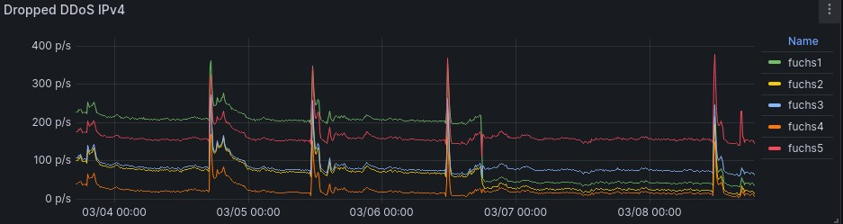

[](https://github.com/vshymanskyy/StandWithUkraine/blob/main/docs/README.md)

# Torutils

Few tools for a Tor relay.

This guide is about the _nftables_ variant.
For _iptables_ proceed with [README-iptables.md](./README-iptables.md).

## DDoS protection

Protect a linux system against DDoS ingress attacks ¹ at [network level](https://thermalcircle.de/doku.php?id=blog:linux:nftables_packet_flow_netfilter_hooks_detail)
as seen in this example:



Another example is [this](./doc/network-metric-July-3rd.jpg).
It reminds me of university lectures on signal processing and detecting sonar echoes in received data.

¹ ticket [40636](https://gitlab.torproject.org/tpo/core/tor/-/issues/40636)
and [40093](https://gitlab.torproject.org/tpo/community/support/-/issues/40093)
of the [Tor project](https://www.torproject.org/).

### Idea

A remote system is considered malicious if its connection attempts to the local Tor instance over a short time interval exceed the expected threshold.
Block such systems for a long time interval.
Further considerations:

- never touch established connections
- avoid overblock

### Quick start

Install _nftables_ , e.g. at Debian:

```bash
sudo apt install -y nftables
```

Download [nftables-ingress.conf](./nftables-ingress.conf).
It contains a complete ruleset for a Linxu system running Tor.
For a regular Tor server replace `LOCAL_ADDRESS_V4`, `LOCAL_ADDRESS_V6`, `NICKNAME` and `TORPORT` with desired values.
Make a syntax check:

```bash
nft -c -f <edited file>
```

Backup your current config (e.g.: `/etc/nftables.conf`) and copy the edited file over it.
Load the new, e.g. at Debian:

```bash
service nftables reload
```

Maybe you need to flush once your current ruleset beforehand:

```bash
nft flush ruleset
```

If your system works as expected - enjoy it.
If something went wrong then restore the backup.
If you need more then please go to [Configuration](#configuration).

### The Rule Set

1. trust any connection attempt from a Tor authority node
2. block the source ¹ for 24 hours if the connection attempt rate from it to the Tor port exceeds

   a) 8/min ² within last 2 minutes - or -

   b) 24/hour within last hour ³

3. ignore the connection attempt if there are already 8 established connections to the Tor port (up to 8 relays per ip address are allowed)
4. accept the connection attempt to the Tor port

A tarpit is used to make port scans for e.g. Tor bridges more expensive.

¹ _source_ is a single ip address for IPv4 and a /64 netmask for IPv6 respectively.

² Values were discussed in [ticket 40636](https://gitlab.torproject.org/tpo/core/tor/-/issues/40636#note_2844146).

³ No overblocking even if either the _source_ and/or the local Tor have a couple of reboots in a short time

### Avoid abuse complaints / server blocking

Every then and when Tor relay operators do get an undesired abuse complaint from my hoster.
Details are in [this](https://gitlab.torproject.org/tpo/network-health/analysis/-/issues/105) ticket.
Append [nftables-egress.conf](./nftables-egress.conf) to netfilter config, then check and load it to avoid complaints.

### Metrics

The script [metrics-firewall.sh](./metrics-firewall.sh) exports firewall metrics into a Prometheus readable file.
More details plus few Grafana dashboards are [here](./dashboards/README.md).

### Configuration

For more Tor at the same ip address, Snowflake, to open more port(s), trust more ip adresses etc. take a look at the sections

```yaml
# ======== TOR DDOS BEGIN ========
# ======== SNOWFLAKE BEGIN ========
# ======== ADDITIONAL BEGIN ========
```

respectively.
The netmask both for IPv4 and IPv6 can be overwritten.

### More DDoS examples

Graphs¹ of rx/tx packets, traffic and socket counts from [5th](./doc/network-metric-Nov-5th.svg),
[6th](./doc/network-metric-Nov-6th.svg) and [7th](./doc/network-metric-Nov-7th.svg) of Nov
show the results for few DDoS attacks over 3 days for 2 relays.
A heavy attack was observed at [12th](./doc/network-metric-Nov-12th.svg) of Nov.
A periodic drop down of the socket count metric, vanishing over time, appeared at
[5th](./doc/network-metric-Dec-05th.svg) of Dec.
Current attacks e.g. at the [7th](./doc/network-metric-Mar-7th.svg) of March are still handled well.
Few more helper scripts were developed to analyze the attack vector.
Look [here](./misc/README.md) for details.

¹ using [sysstat](http://sebastien.godard.pagesperso-orange.fr/)

# More stuff

## Query Tor via its API

### Relay summary

[info.py](./tools/info.py) gives a summary of all Tor related TCP connections, e.g.:

```console
sudo ./info.py --address 127.0.0.1 --ctrlport 9051

 ORport 9051  0.4.8.0-alpha-dev   uptime: 02:58:04   flags: Fast, Guard, Running, Stable, V2Dir, Valid
+------------------------------+-------+-------+
| Type                         |  IPv4 |  IPv6 |
+------------------------------+-------+-------+
| Inbound to our OR from relay |  2304 |   885 |
| Inbound to our OR from other |  3188 |    68 |
| Inbound to our ControlPort   |       |     1 |
| Outbound to relay OR         |  2551 |   629 |
| Outbound to relay non-OR     |       |       |
| Outbound exit traffic        |       |       |
| Outbound unknown             |    16 |     4 |
+------------------------------+-------+-------+
| Total                        |  8059 |  1587 |
+------------------------------+-------+-------+
 relay OR connections  6369
 relay OR ips          5753
    3 inbound v4 with > 2 connections each
```

### Watch Tor Exit connections

If your Tor relay is an _Exit_ then [ps.py](./tools/ps.py) gives live statistics about those network connections:

```bash
sudo ./ps.py --address 127.0.0.1 --ctrlport 9051
```

### Tor circuit closings

[orstatus.py](./tools/orstatus.py) prints the _closing reason_ to stdout,
[orstatus-stats.sh](./tools/orstatus-stats.sh) prints/plots statistics ([see this example](./doc/orstatus-stats.sh.txt)) from that.

```bash
orstatus.py --ctrlport 9051 --address 127.0.0.1 >>/tmp/orstatus &
sleep 3600
orstatus-stats.sh /tmp/orstatus
```

### Prerequisites

An open Tor control port is needed to query the Tor process via API.
Configure it in _torrc_, e.g.:

```console
ControlPort 127.0.0.1:9051
```

The python library [Stem](https://stem.torproject.org/index.html) is needed.
Clone and use it:

```bash
git clone https://github.com/torproject/stem.git
export PYTHONPATH=$PWD/stem
```

## Check expiration of Tor offline keys

[key-expires.py](./tools/key-expires.py) helps to maintain
[Tor offline keys](https://support.torproject.org/relay-operators/offline-ed25519/).
It returns the expiration time in seconds of the mid-term signing key.
A cronjob for that task could look like this:

```bash
seconds=$(sudo ./key-expires.py /var/lib/tor/keys/ed25519_signing_cert)
days=$((seconds / 86400))
[[ $days -lt 23 ]] && echo "Tor signing key expires in less than $days day(s)"
```

If Tor metrics are enabled then this 1-liner does a similar job (replace `9052` with your metrics port):

```bash
date -d@$(curl -s localhost:9052/metrics | grep "^tor_relay_signing_cert_expiry_timestamp" | awk '{ print $2 }')
```

## Search logs for pre-defined text patterns

The script [watch.sh](./tools/watch.sh) helps to constantly monitor the host and Tor log files.
It sends findings via _mailx_.

```bash
log=/tmp/${0##*/}.log

# watch syslog
/opt/torutils/watch.sh /var/log/messages /opt/torutils/watch-messages.txt &>>$log &
# watch Tor
/opt/torutils/watch.sh /var/log/tor/notice.log /opt/torutils/watch-tor.txt -v &>>$log &
```

# Participation

I appreciate reports via the [issue](https://github.com/toralf/torutils/issues) tracker.

# More

I use [this](https://github.com/toralf/tor-relays/) project maintain Tor relays, bridges and Snowflake standalone proxies and more.
