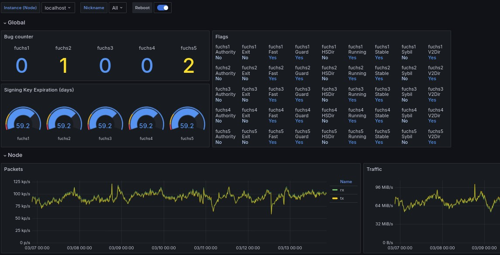

[](https://github.com/vshymanskyy/StandWithUkraine/blob/main/docs/README.md)

# Tor Grafana Dashboards

Few dashboards for Tor relays, Snowflake and the DDoS metrics.



## Scraping Tor metrics

An Ansible example to scrape metrics is given [here](https://github.com/toralf/tor-relays/?tab=readme-ov-file#metrics).
The Prometheus config needs to set the _nickname_, i.e. it is set using the address (usually the hostname):

```yaml
- job_name: "Tor-Relay"
  metrics_path: "/metrics-relay"
  scheme: https
  tls_config:
    ca_file: "CA.crt"
  file_sd_configs:
    - files:
      - 'foo.yaml'
  relabel_configs:
    - source_labels: [__address__]
      target_label: nickname
      regex: "([^:]+).*:(.).*"
      replacement: "my-nick-prefix-${1}"
```

and _foo.yaml_ contains the targets:

```yaml
- targets: [...
- targets: [...
...
```
